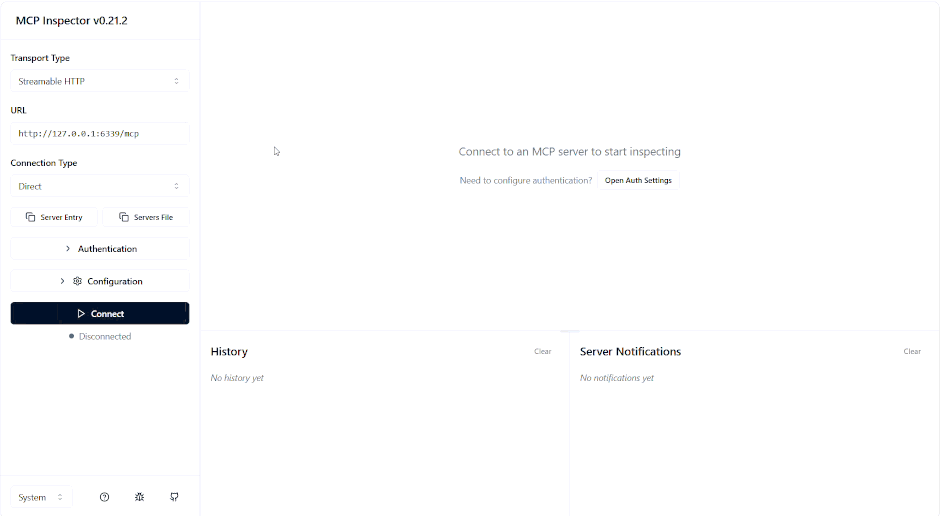

# MCP OAuth Flow

OAuth 2.0 Flow для MCP Inspector и совместимых клиентов / OAuth 2.0 Flow for MCP Inspector and compatible clients

- Authorization Code + PKCE флоу (RFC 6749 + RFC 7636)
- Форма логин/пароль / Login form (username/password)
- JWT `access_token` + `refresh_token` с ротацией / JWT `access_token` + `refresh_token` with rotation
- `/.well-known/oauth-authorization-server` (RFC 8414)
- Отзыв токенов (RFC 7009) / Token revocation (RFC 7009)
- Хранение пользователей с bcrypt-хешами / User storage with bcrypt hashes



## Архитектура / Architecture

```
Браузер / MCP Inspector
       │
       ▼
  nginx (443 HTTPS)
       │
       ├──/oauth/──► oauth_server.py :9002 (логин, выдача JWT / login, JWT issuance)
       ├──/.well-known/──► oauth_server.py :9002 (метаданные OAuth / OAuth metadata)
       └──/mcp──► mcp_server.py :6339 (MCP, проверяет JWT / MCP, verifies JWT)
```

Пользователь в MCP Inspector вводит URL сервера -> Inspector сам обнаруживает
OAuth, открывает браузер с формой логина -> после входа токен подставляется
автоматически.

User enters server URL in MCP Inspector -> Inspector auto-discovers OAuth,
opens browser with login form -> after sign-in the token is injected automatically.

## Ограничения (важно знать до деплоя) / Limitations (know before deploy)

- **Нет инвалидации всех сессий пользователя разом** - только поштучный revoke по
  конкретному токену. Если нужно разлогинить пользователя на всех устройствах,
  придётся крутить `OAUTH_SECRET_KEY` (все JWT станут невалидными).
- **`/oauth/revoke` и `/oauth/token/info` по умолчанию открыты всем**
  В проде обязательно задавать `OAUTH_RESOURCE_SERVER_SECRET` - см. раздел
  «Обязательные переменные для прода».
- **CORS по умолчанию разрешает только `http://localhost:6274` и
  `http://127.0.0.1:6274`** (MCP Inspector). Для своего origin задавать
  `OAUTH_CORS_ORIGINS` явно.
- **CLI-команды (`--add-user`, `--list-users`, `--remove-user`) ходят в ту же
  SQLite-БД**, что и сервер. При активном сервисе возможна задержка до 30с из-за
  `database is locked` (см. `_DB_CONNECT_TIMEOUT` в коде). Останавливать сервис на время правки.
- **Нет refresh-token rotation detection** (TODO в коде). Утёкший refresh-токен
  нельзя отозвать до истечения `expires_at`, кроме как явным `POST /oauth/revoke`.
- **bcrypt обрезает пароли длиннее 72 байт** (TODO в коде). Для длинных
  passphrase-ов - argon2/scrypt.

- **No bulk session invalidation** — only per-token revoke. To log a user out across
  all devices, rotate `OAUTH_SECRET_KEY` (all JWTs become invalid).
- **`/oauth/revoke` and `/oauth/token/info` are open by default** — in prod
  always set `OAUTH_RESOURCE_SERVER_SECRET` (see "Required prod env vars" section).
- **CORS allows only `http://localhost:6274` and `http://127.0.0.1:6274` by
  default** (MCP Inspector). For a custom origin, set `OAUTH_CORS_ORIGINS` explicitly.
- **CLI commands (`--add-user`, `--list-users`, `--remove-user`) hit the same
  SQLite DB** as the server. With the service running you may wait up to 30s due
  to `database is locked` (see `_DB_CONNECT_TIMEOUT` in code). Stop the service
  for the duration of edits.
- **No refresh-token rotation detection** (TODO in code). A leaked refresh token
  cannot be revoked before `expires_at` — only via an explicit `POST /oauth/revoke`.
- **bcrypt truncates passwords longer than 72 bytes** (TODO in code). For long
  passphrases — use argon2/scrypt.

---

## Тестовый локальный запуск / Local test run

```bash
sudo apt install python3-tk
cd ~/McpOAuthFlow
python3 -m venv v_env
source v_env/bin/activate
pip install -r requirements.txt
cd ~/McpOAuthFlow && source v_env/bin/activate && python3 oauth_server.py --add-user admin admin
cd ~/McpOAuthFlow && source v_env/bin/activate && OAUTH_HOST="http://localhost" OAUTH_PORT="9002" OAUTH_SECRET_KEY="de01969527df1b0ef32e58eccb078819851b2a1a4a34478f38794ad2d72bce97" python3 oauth_server.py
cd ~/McpOAuthFlow && source v_env/bin/activate && OAUTH_SECRET_KEY="de01969527df1b0ef32e58eccb078819851b2a1a4a34478f38794ad2d72bce97" OAUTH_ISSUER="http://localhost:9002/oauth" python3 mcp_server.py
npx @modelcontextprotocol/inspector@0.21.2
```

---

## Генерируем секретный ключ / Generate the secret key

Один ключ используется в **обоих** сервисах (`oauth_server` и `mcp_server`) - они должны совпадать.
One key is used in **both** services (`oauth_server` and `mcp_server`) — they must match.

```bash
python3 -c "import secrets; print(secrets.token_hex(32))"
# Сохранить вывод, далее это OAUTH_SECRET_KEY
# Save the output; this becomes OAUTH_SECRET_KEY
# Пример: a3f8d2c1e4b7...
# Example: a3f8d2c1e4b7...
```

Сгенерировать заодно секрет для resource-server-эндпоинтов для прода:
Generate a secret for resource-server endpoints for prod as well:

```bash
python3 -c "import secrets; print(secrets.token_hex(32))"
# Сохранить, далее это OAUTH_RESOURCE_SERVER_SECRET
# Save it; this becomes OAUTH_RESOURCE_SERVER_SECRET
```

---

## Установка / Install

```bash
sudo apt install python3-tk
mkdir -p /opt/mcp
chown -R www-data:www-data /opt/mcp
chmod 755 /opt/mcp

cp ~/McpOAuthFlow/requirements.txt /opt/mcp/requirements.txt
cp ~/McpOAuthFlow/oauth_server.py /opt/mcp/oauth_server.py
cp ~/McpOAuthFlow/mcp_server.py /opt/mcp/mcp_server.py

cd /opt/mcp
python3 -m venv v_env
source v_env/bin/activate
pip install -r requirements.txt
```

---

## Обязательные переменные для прода / Required prod env vars

### OAuth-сервер (`mcp-oauth.service`) / OAuth server

| Переменная / Variable | Обязательная / Required | Назначение / Purpose |
|---|---|---|
| `OAUTH_SECRET_KEY` | да / yes | Секрет подписи JWT (≥ 32 символов) / JWT signing secret (≥ 32 chars) |
| `OAUTH_HOST` | да / yes | Публичный URL, например `https://mcp.example.com`. Без `/oauth` на конце - oauth_server допишет / Public URL, e.g. `https://mcp.example.com`. No trailing `/oauth` — oauth_server appends it |
| `OAUTH_PORT` | нет (9002) / no (9002) | Внутренний порт, на котором слушает oauth_server / Internal port oauth_server listens on |
| `OAUTH_BIND_HOST` | нет (127.0.0.1) / no (127.0.0.1) | На каком интерфейсе слушать. Для Docker - `0.0.0.0` / Interface to bind. For Docker — `0.0.0.0` |
| `MCP_SERVER_URL` | нет (`http://localhost:6339/mcp`) / no | URL MCP-сервера, прописывается в метаданные OAuth / MCP server URL, written into OAuth metadata |
| `OAUTH_CORS_ORIGINS` | да для прода / yes for prod | Свой origin через запятую, например `https://mcp.example.com`. Пустая строка `""` - CORS выключен / Your origin, comma-separated, e.g. `https://mcp.example.com`. Empty string `""` — CORS off |
| `OAUTH_RESOURCE_SERVER_SECRET` | да для прода / yes for prod | Bearer-токен для `/oauth/revoke` и `/oauth/token/info`. Если не задан, то эти эндпоинты открыты / Bearer token for `/oauth/revoke` and `/oauth/token/info`. If unset, those endpoints are open |
| `OAUTH_TRUSTED_PROXIES` | да для прода за nginx / yes for prod behind nginx | IP nginx (например `127.0.0.1`), чтобы rate-limit видел реальный IP клиента из `X-Forwarded-For` / nginx IP (e.g. `127.0.0.1`) so rate-limit sees the real client IP from `X-Forwarded-For` |
| `OAUTH_DB` | нет / no | Путь к SQLite. Для прод лучше вынести в `/var/lib/mcp/oauth_users.db` / SQLite path. For prod, prefer `/var/lib/mcp/oauth_users.db` |

### MCP-сервер (`mcp-server.service`) / MCP server

| Переменная / Variable | Обязательная / Required | Назначение / Purpose |
|---|---|---|
| `OAUTH_SECRET_KEY` | да / yes | Тот же, что в oauth_server / Same as in oauth_server |
| `OAUTH_ISSUER` | да / yes | Полный issuer с `/oauth`, например `https://mcp.example.com:9002/oauth`, `https://mcp.example.com/oauth` / Full issuer with `/oauth`, e.g. `https://mcp.example.com:9002/oauth`, `https://mcp.example.com/oauth` |

---

## systemd-сервис для OAuth-сервера / systemd unit for OAuth server

```bash
cat > /etc/systemd/system/mcp-oauth.service << 'EOF'
[Unit]
Description=MCP OAuth 2.0 Authorization Server
After=network.target

[Service]
Type=simple
User=www-data
WorkingDirectory=/opt/mcp
Environment="OAUTH_SECRET_KEY=ВСТАВЬТЕ_СВОЙ_СЕКРЕТ"
Environment="OAUTH_HOST=https://mcp.example.com"
Environment="OAUTH_PORT=9002"
Environment="OAUTH_BIND_HOST=127.0.0.1"
Environment="MCP_SERVER_URL=http://localhost:6339/mcp"
# Для прод-деплоя раскомментировать и подставить свои значения:
# Environment="OAUTH_CORS_ORIGINS=https://mcp.example.com"
# Environment="OAUTH_RESOURCE_SERVER_SECRET=ВСТАВИТЬ_СВОЙ_СЕКРЕТ"
# Environment="OAUTH_TRUSTED_PROXIES=127.0.0.1"
# Если выносите БД из /opt/mcp:
# Environment="OAUTH_DB=/var/lib/mcp/oauth_users.db"
ExecStart=/opt/mcp/v_env/bin/python /opt/mcp/oauth_server.py
Restart=always
RestartSec=5

[Install]
WantedBy=multi-user.target
EOF
```

---

## systemd-сервис для MCP-сервера / systemd unit for MCP server

```bash
cat > /etc/systemd/system/mcp-server.service << 'EOF'
[Unit]
Description=MCP Programming Search Server
After=network.target

[Service]
Type=simple
User=www-data
WorkingDirectory=/opt/mcp
Environment="OAUTH_SECRET_KEY=ВСТАВЬТЕ_ТЕМ_ЖЕ_ЧТО_В_MCP-OAUTH"
Environment="OAUTH_ISSUER=https://mcp.example.com/oauth"
ExecStart=/opt/mcp/v_env/bin/python /opt/mcp/mcp_server.py
Restart=always
RestartSec=5

[Install]
WantedBy=multi-user.target
EOF
```

> `OAUTH_SECRET_KEY` должен быть **одинаковым** в обоих сервисах.
> `OAUTH_SECRET_KEY` must be **identical** in both services.

---

## Настраиваем nginx / Configure nginx

```bash
# Заменяем домен в конфиге nginx.conf
# Replace the domain in nginx.conf
cp ~/McpOAuthFlow/nginx.conf /etc/nginx/sites-available/mcp
ln -sf /etc/nginx/sites-available/mcp /etc/nginx/sites-enabled/

# Проверяем конфиг / Validate the config
nginx -t

# Применяем конфиг (пока без SSL - только HTTP для certbot)
# Apply the config (HTTP-only for now, for certbot)
systemctl reload nginx
```

---

## Получаем SSL-сертификат Let's Encrypt / Get a Let's Encrypt SSL cert

```bash
certbot --nginx -d ДОМЕН
# certbot сам отредактирует конфиг nginx и добавит ssl_certificate строки
# certbot will edit the nginx config and add ssl_certificate lines
# После этого перезагрузите конфиг ещё раз:
# Then reload the config again:
systemctl reload nginx
```

Альтернативный шаблон nginx с автопродлением: https://github.com/Arlandaren/nginx-template

---

## Добавляем пользователей / Add users

CLI работает напрямую с SQLite-БД oauth_server'а. При активном сервисе
команды могут ждать до 30 секунд из-за блокировки.
The CLI talks directly to oauth_server's SQLite DB. With the service running,
commands may wait up to 30 seconds due to the lock.

```bash
# Добавить пользователя / Add a user
cd /opt/mcp && source v_env/bin/activate && python3 oauth_server.py --add-user alice СЕКРЕТНЫЙ_ПАРОЛЬ
cd /opt/mcp && source v_env/bin/activate && python3 oauth_server.py --add-user bob ДРУГОЙ_СЕКРЕТНЫЙ_ПАРОЛЬ

# Посмотреть список / List users
cd /opt/mcp && source v_env/bin/activate && python3 oauth_server.py --list-users

# Удалить пользователя / Remove a user
cd /opt/mcp && source v_env/bin/activate && python3 oauth_server.py --remove-user alice
```

### Как удалить всех пользователей / How to wipe all users

```bash
# ВАЖНО: сначала остановите сервис, иначе WAL пересоздаст файл
# и текущие активные сессии потеряются, но без чистого завершения.
# IMPORTANT: stop the service first, otherwise WAL will recreate the file
# and active sessions will be lost — without a clean shutdown.
systemctl stop mcp-oauth
rm -f /opt/mcp/oauth_users.db /opt/mcp/oauth_users.db-wal /opt/mcp/oauth_users.db-shm
systemctl start mcp-oauth
```

---

## Запускаем сервисы / Start the services

```bash
systemctl daemon-reload

systemctl enable mcp-oauth mcp-server
systemctl start  mcp-oauth mcp-server

# Проверяем статус / Check status
systemctl status mcp-oauth
systemctl status mcp-server
```

---

## Подключение через MCP Inspector / Connect via MCP Inspector

1. Открыть MCP Inspector (`npx @modelcontextprotocol/inspector`).
2. Transport Type: **Streamable HTTP**.
3. Server URL: `https://ДОМЕН/mcp`.
4. Нажать **Connect** / Click **Connect**.
5. Inspector обнаружит OAuth и откроет браузер с формой логина.
   Inspector will discover OAuth and open a browser with the login form.
6. Ввести логин/пароль -> токен подставится автоматически.
   Enter username/password -> the token is injected automatically.

---

## Подключение через Claude Desktop / Cursor / другой AI-клиент / Connect via Claude Desktop / Cursor / other AI client

```json
{
  "mcpServers": {
    "programming-search": {
      "type": "streamable-http",
      "url": "https://ДОМЕН/mcp",
      "oauth": {
        "issuer": "https://ДОМЕН/oauth"
      }
    }
  }
}
```

> Формат `oauth.issuer` - конвенция MCP, не этого сервера. Поддержка зависит
> от конкретного клиента; для Inspector работает, для Claude Desktop / Cursor
> может потребовать адаптации.
> The `oauth.issuer` format is an MCP convention, not this server's. Support
> depends on the specific client; works in Inspector, may need adaptation for
> Claude Desktop / Cursor.

---

## Структура файлов на сервере / Server file layout

```
/opt/mcp/
├── mcp_server.py - MCP-сервер (порт 6339) / MCP server (port 6339)
├── oauth_server.py - OAuth-сервер (порт 9002) / OAuth server (port 9002)
├── v_env/ - Python venv
├── requirements.txt
└── oauth_users.db - SQLite с пользователями (создаётся автоматически; если вынесли - путь см. в OAUTH_DB)
                       / SQLite with users (auto-created; if relocated, see OAUTH_DB)

-/etc/systemd/system/mcp-oauth.service
/etc/systemd/system/mcp-server.service
```

---

## Бэкап и восстановление / Backup and restore

`oauth_users.db` содержит:
`oauth_users.db` contains:
- bcrypt-хеши паролей пользователей;
- активные refresh-токены (пока не истекли);
- `failed_logins` (используется для lockout-а - можно чистить).

- bcrypt password hashes;
- active refresh tokens (until expiry);
- `failed_logins` (used for lockout — safe to clear).

Рекомендуемая схема / Recommended scheme:

```bash
# Ежедневный бэкап / Daily backup
sqlite3 /opt/mcp/oauth_users.db ".backup /var/backups/mcp/oauth_$(date +%F).db"

# Восстановление / Restore
systemctl stop mcp-oauth
cp /var/backups/mcp/oauth_2025-01-15.db /opt/mcp/oauth_users.db
chown www-data:www-data /opt/mcp/oauth_users.db
systemctl start mcp-oauth
```

Бэкап через `.backup` безопасен при работающем сервисе (атомарный snapshot через
WAL), но восстановление только после `stop`.
`.backup` is safe while the service is running (atomic WAL snapshot), but restore
only after `stop`.

---

## Ротация секретов / Secret rotation

### `OAUTH_SECRET_KEY` (главный JWT-секрет / main JWT secret)

Если ключ утёк, нужно **одновременно** обновить его в обоих сервисах и
перезапустить их. Все текущие `access_token` и `refresh_token` станут
невалидными и пользователям придётся залогиниться заново.
If the key leaks, update it in **both** services **simultaneously** and restart
them. All current `access_token` and `refresh_token` become invalid and users
must sign in again.

```bash
# Сгенерировать новый ключ / Generate a new key
NEW_KEY=$(python3 -c "import secrets; print(secrets.token_hex(32))")

# Обновить в обоих юнитах / Update in both units
sed -i "s/OAUTH_SECRET_KEY=.*/OAUTH_SECRET_KEY=$NEW_KEY/" /etc/systemd/system/mcp-oauth.service
sed -i "s/OAUTH_SECRET_KEY=.*/OAUTH_SECRET_KEY=$NEW_KEY/" /etc/systemd/system/mcp-server.service

# Перезапустить / Restart
systemctl daemon-reload
systemctl restart mcp-oauth mcp-server
```

### `OAUTH_RESOURCE_SERVER_SECRET`

```bash
# Сгенерировать / Generate
NEW_RS=$(python3 -c "import secrets; print(secrets.token_hex(32))")

# Обновить в oauth-юните / Update in the oauth unit
sed -i "s/OAUTH_RESOURCE_SERVER_SECRET=.*/OAUTH_RESOURCE_SERVER_SECRET=$NEW_RS/" /etc/systemd/system/mcp-oauth.service

# Обновить у всех клиентов, которые ходят в /oauth/revoke и /oauth/token/info
# (это делает админ, клиенты не входят в этот репозиторий)
# Update on all clients that hit /oauth/revoke and /oauth/token/info
# (admin's job — clients are not part of this repo)

# Перезапустить / Restart
systemctl daemon-reload
systemctl restart mcp-oauth
```

---

## Обновление / Upgrade

```bash
# Бэкап БД / DB backup
systemctl stop mcp-oauth
cp /opt/mcp/oauth_users.db /var/backups/mcp/oauth_$(date +%F)_pre-upgrade.db

# Копируем новые файлы / Copy new files
scp mcp_server.py user@your-server:/opt/mcp/
scp oauth_server.py user@your-server:/opt/mcp/

# Перезапускаем / Restart
systemctl start mcp-oauth
systemctl restart mcp-server

# Проверяем логи / Check logs
journalctl -u mcp-oauth -f
# При первом старте после обновления могут появиться строки вида
# "duplicate column name: scope" - это нормальная миграция БД (ALTER TABLE
# IF NOT EXISTS через try/except). Должны пройти за 1-2 секунды и больше
# не появляться.
# On the first start after an upgrade you may see lines like
# "duplicate column name: scope" — that's a normal DB migration (ALTER TABLE
# IF NOT EXISTS via try/except). They should clear in 1-2 seconds and not
# reappear.
```

Если после обновления в логах ошибки - откатываться:
If logs show errors after upgrade — roll back:

```bash
systemctl stop mcp-oauth mcp-server
cp /var/backups/mcp/oauth_YYYY-MM-DD_pre-upgrade.db /opt/mcp/oauth_users.db
scp ~/McpOAuthFlow/oauth_server.py user@your-server:/opt/mcp/   # предыдущая версия / previous version
systemctl start mcp-oauth mcp-server
```

---

## Приложение. Сертификат на IP (без домена) - 6-дневные сертификаты / Appendix. IP cert (no domain) — 6-day certs

> Этот раздел нужен **только** если нет домена и нужен HTTPS прямо на IP-адрес.
> Если домен есть - не делать.
> This section is needed **only** if you have no domain and need HTTPS directly
> on an IP address. If you have a domain — skip it.

Let's Encrypt с января 2026 года выдаёт сертификаты на IP-адреса, но **только**
с профилем `shortlived` (срок жизни - 160 часов, ~6 дней). Поэтому обязательно
нужно настроить автоматическое обновление через cron.
Since January 2026 Let's Encrypt issues IP-address certs **only** under the
`shortlived` profile (lifetime 160h, ~6 days). So you must configure auto-renewal via cron.

### Вариант А - Certbot ≥ 5.3 (флаг `--ip-address`) / Option A

```bash
# Убедитесь что версия 5.3+ / Make sure it's 5.3+
certbot --version

# Обновить если нужно: / Upgrade if needed:
pip3 install --upgrade certbot

# Создаём директорию для webroot-challenge (nginx должен её отдавать)
# Create webroot-challenge dir (nginx must serve it)
mkdir -p /var/www/certbot

# Убедитесь что nginx проксирует /.well-known/acme-challenge/ из этой папки.
# В nginx.conf для порта 80 уже есть нужный блок:
#   location /.well-known/acme-challenge/ { root /var/www/certbot; }
# Make sure nginx serves /.well-known/acme-challenge/ from this folder.
# The port-80 nginx.conf already has the right block.

# Тест на staging (не выдаёт реальный сертификат, но проверяет всё):
# Staging test (no real cert, but verifies everything):
certbot certonly --staging \
    --preferred-profile shortlived \
    --webroot --webroot-path /var/www/certbot \
    --ip-address ВАШ_IP_АДРЕС

# Если тест прошёл - получаем боевой сертификат:
# If the test passed — get the production cert:
certbot certonly \
    --preferred-profile shortlived \
    --webroot --webroot-path /var/www/certbot \
    --ip-address ВАШ_IP_АДРЕС

# Сертификат появится в:
# /etc/letsencrypt/live/ВАШ_IP_АДРЕС/fullchain.pem
# /etc/letsencrypt/live/ВАШ_IP_АДРЕС/privkey.pem
```

> Certbot 5.3 не умеет автоматически прописывать IP-сертификаты в nginx.
> Нужно прописать пути вручную в `nginx_mcp.conf`:
> ```nginx
> ssl_certificate     /etc/letsencrypt/live/ВАШ_IP/fullchain.pem;
> ssl_certificate_key /etc/letsencrypt/live/ВАШ_IP/privkey.pem;
> ```
> Certbot 5.3 can't auto-wire IP certs into nginx. You must set the paths
> manually in `nginx_mcp.conf`:
> ```nginx
> ssl_certificate     /etc/letsencrypt/live/ВАШ_IP/fullchain.pem;
> ssl_certificate_key /etc/letsencrypt/live/ВАШ_IP/privkey.pem;
> ```

### Вариант Б - lego (проще для IP, не требует webroot) / Option B

`lego` - альтернативный ACME-клиент, уже полностью поддерживает IP + shortlived.
Плюс: запускает встроенный HTTP-сервер сам, не нужен webroot.
Минус: нужно на время обновления останавливать nginx (освобождать порт 80).
`lego` is an alternative ACME client with full IP + shortlived support.
Plus: runs its own built-in HTTP server, no webroot needed.
Minus: you must stop nginx for the renewal (freeing port 80).

```bash
# Устанавливаем lego / Install lego
curl -Lo /tmp/lego.tar.gz \
    https://github.com/go-acme/lego/releases/latest/download/lego_v4.23.1_linux_amd64.tar.gz
tar -xz -C /usr/local/bin -f /tmp/lego.tar.gz lego

# Получаем первый сертификат (nginx нужно остановить на ~30 секунд):
# Get the first cert (stop nginx for ~30s):
systemctl stop nginx
lego --accept-tos \
     --email admin@example.com \
     --domains ВАШ_IP_АДРЕС \
     --http --disable-cn \
     run --profile shortlived
systemctl start nginx

# Сертификат появится в:
# /root/.lego/certificates/ВАШ_IP_АДРЕС.crt
# /root/.lego/certificates/ВАШ_IP_АДРЕС.key
```

Прописываем в nginx / Wire it into nginx:
```nginx
ssl_certificate     /root/.lego/certificates/ВАШ_IP_АДРЕС.crt;
ssl_certificate_key /root/.lego/certificates/ВАШ_IP_АДРЕС.key;
```

```bash
systemctl reload nginx
```

### Автообновление через cron (обязательно - сертификат живёт 6 дней) / Auto-renewal via cron (required — cert lives 6 days)

Сертификат нужно обновлять каждые **4–5 дней** (до истечения 6-дневного срока).
Renew the cert every **4–5 days** (before the 6-day lifetime expires).

**Для Certbot** (вариант А) - создаём deploy-hook, который перезагружает nginx
после обновления, и добавляем в cron:
**For Certbot** (option A) — create a deploy-hook that reloads nginx after renewal,
and add it to cron:

```bash
# Deploy-hook - перезагружает nginx после успешного обновления
# Deploy-hook — reloads nginx after a successful renewal
cat > /etc/letsencrypt/renewal-hooks/deploy/reload-nginx.sh << 'EOF'
#!/bin/bash
systemctl reload nginx
EOF
chmod +x /etc/letsencrypt/renewal-hooks/deploy/reload-nginx.sh

# Добавляем в cron - запуск каждые 4 дня в 3:00 (время сервера)
# (certbot сам проверяет нужно ли обновлять; webroot не требует остановки nginx)
# Add to cron — every 4 days at 03:00 (server time)
# (certbot itself checks if renewal is needed; webroot doesn't require stopping nginx)
crontab -e
# Добавить строку: / Add this line:
0 3 */4 * * certbot renew --quiet
```

**Для lego** (вариант Б) - nginx нужно останавливать на время обновления:
**For lego** (option B) — nginx must be stopped during renewal:

```bash
# Скрипт обновления / Renewal script
cat > /opt/mcp/renew-cert.sh << 'EOF'
#!/bin/bash
set -e
systemctl stop nginx
lego --accept-tos \
     --email admin@example.com \
     --domains ВАШ_IP_АДРЕС \
     --http --disable-cn \
     renew --profile shortlived
systemctl start nginx
systemctl reload nginx
EOF
chmod +x /opt/mcp/renew-cert.sh

# Добавляем в cron - каждые 4 дня в 3:00 (время сервера)
# Add to cron — every 4 days at 03:00 (server time)
crontab -e
# Добавить строку: / Add this line:
0 3 */4 * * /opt/mcp/renew-cert.sh >> /var/log/lego-renew.log 2>&1
```

> **Сколько nginx будет недоступен?** Обычно 10–30 секунд - только на время
> ACME-challenge.
> **How long is nginx down?** Usually 10–30 seconds — only for the ACME
> challenge.

---
